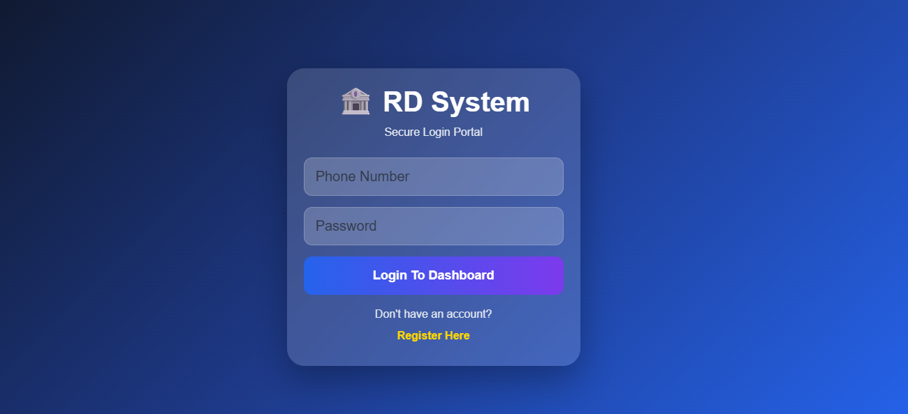
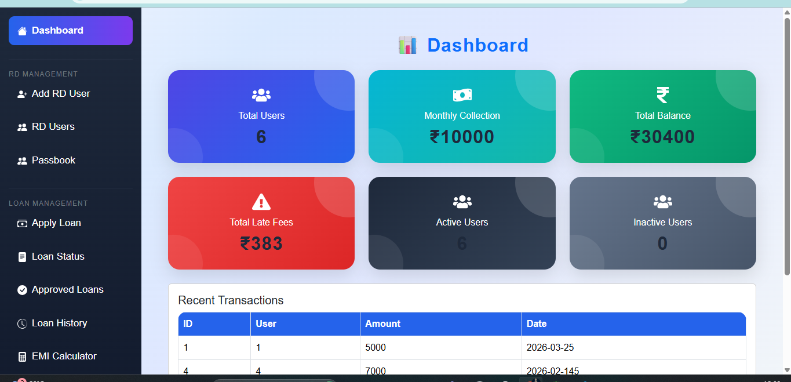
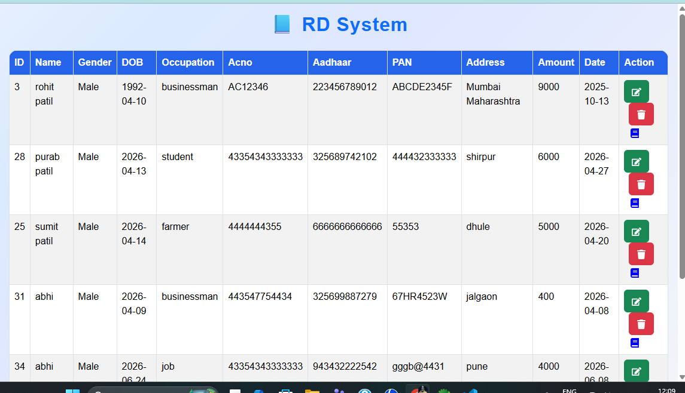
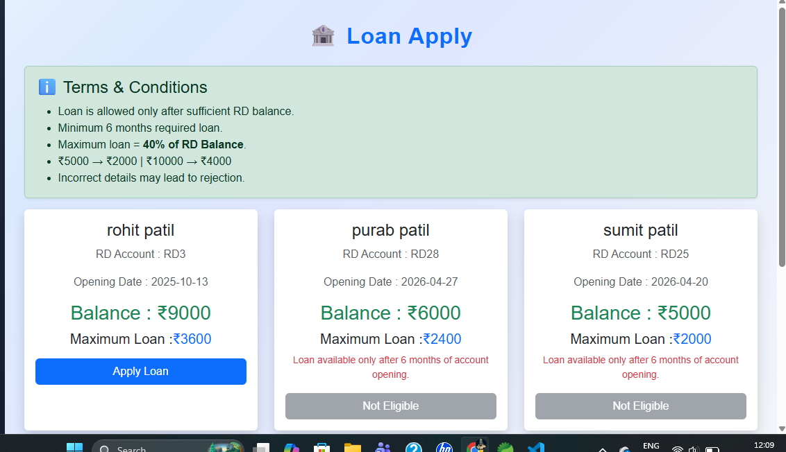
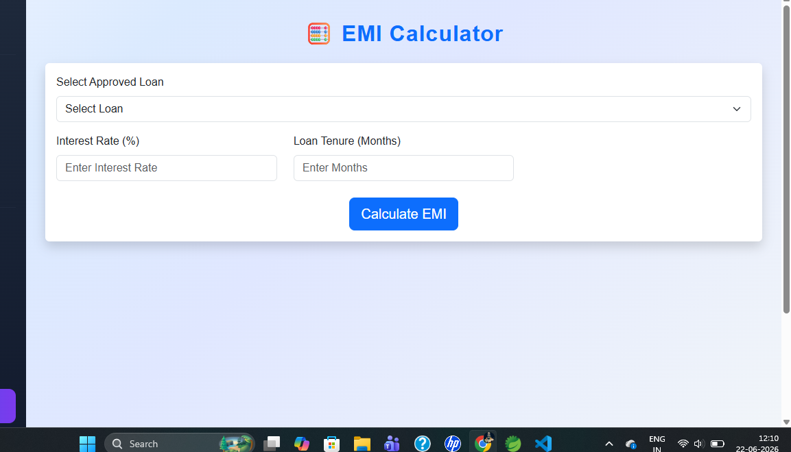
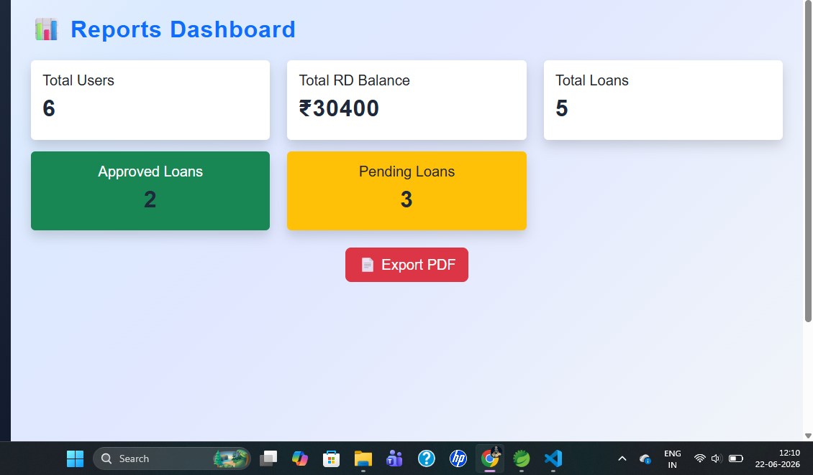

🚀 RD System - Recurring Deposit Management System
📌 Overview

RD System is a Full Stack Web Application developed using Spring Boot, React.js, PostgreSQL, Hibernate and Bootstrap.

The system helps financial institutions manage recurring deposit accounts, customer details, transactions, passbooks, loans and reports efficiently.

## Features

- User Registration & Login
- Dashboard Analytics
- Create RD Account
- RD User Management
- Transaction History
- Loan Eligibility Check
- Loan History Tracking
- EMI Calculator
- Reports Dashboard
- PDF Report Export
- Logout

🛠 Technologies Used
Frontend
- React.js
- React Bootstrap
- Axios

Backend 
- Springboot
- Spring data JPA
- Hiberanate
- REST API

Database
- PostgreSQL

## Screenshots

### Login

### Dashboard

### RD Users

### Loan Apply

### EMI Calculator

### Reports

👨‍💻 Author

Sumit Patil

Java Full Stack Developer
